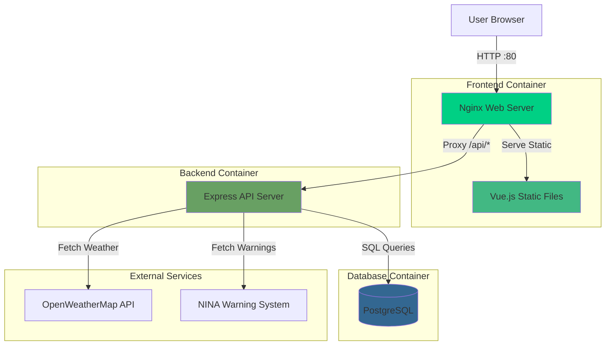
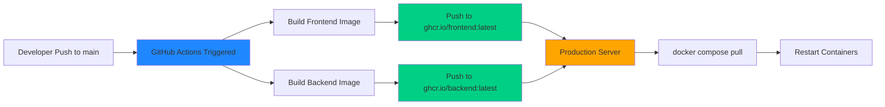

# SmartCities Web Portal

[](https://github.com/TheSynus/SWP-SS25-SmartCities/actions/workflows/docker-build.yml)

A modern municipal web portal for displaying city information, events, weather data, emergency warnings, and community appointments. Built as a comprehensive solution for local government digital services.

## Features

- **📊 Dashboard**: Customizable widgets showing weather, graphs, and important information
- **📅 Calendar**: Event management with recurring appointments and categories
- **🗺️ Interactive Map**: Community events and points of interest with custom markers
- **⚠️ Emergency Warnings**: Real-time NINA (German emergency warning system) integration
- **🌤️ Weather Data**: Live weather information via OpenWeatherMap API
- **📱 Responsive Design**: Mobile-friendly interface built with TailwindCSS

## Architecture

### System Overview



### Request Flow

1. **Static Content**: User requests → Nginx → Vue.js app served directly
2. **API Requests**: User requests `/api/*` → Nginx proxy → Express backend → PostgreSQL/External APIs
3. **Data Updates**: Backend fetches data from external APIs → Stores in PostgreSQL → Serves to frontend

## Technology Stack

### Frontend
- **Framework**: Vue 3 with Composition API
- **Language**: TypeScript
- **Build Tool**: Vite
- **Styling**: TailwindCSS v4 + Flowbite components
- **Maps**: Leaflet with Vue3-Leaflet
- **HTTP Client**: Axios
- **Routing**: Vue Router

### Backend
- **Runtime**: Node.js 22 (Alpine)
- **Framework**: Express.js
- **Database Driver**: node-postgres (pg)
- **APIs**: OpenWeatherMap, NINA Emergency Warnings

### Database
- **DBMS**: PostgreSQL 18.1
- **Admin Tool**: pgAdmin 4 (development only)

### DevOps
- **Containerization**: Docker & Docker Compose
- **CI/CD**: GitHub Actions
- **Registry**: GitHub Container Registry (ghcr.io)
- **Web Server**: Nginx (production)

## Quick Start - Development

### Prerequisites
- Node.js 18+ and npm
- Docker & Docker Compose
- Git

### 1. Clone the Repository

```bash
git clone git@github.com:TheSynus/SWP-SS25-SmartCities.git
cd SWP-SS25-SmartCities
```

### 2. Frontend Development

```bash
cd SmartCities

# Install dependencies
npm install

# Start dev server (http://localhost:5173)
npm run dev

# Type checking
npm run type-check

# Linting
npm run lint

# Build for production
npm run build
```

> **📘 For detailed frontend setup and IDE configuration, see [SmartCities/README.md](SmartCities/README.md)**

### 3. Backend Development

```bash
cd SmartCities_Backend

# Start PostgreSQL, pgAdmin, and API with Docker
./restart.sh

# Or manually with docker compose
docker compose up -d

# View API logs
docker compose logs -f api
```

**Backend Services:**
- API: http://localhost:3000
- pgAdmin: http://localhost:8080 (admin@example.com / admin123)
- PostgreSQL: localhost:5432 (admin / Admin!1234)

> **📘 For detailed backend architecture, API documentation, and database schema, see [SmartCities_Backend/README.md](SmartCities_Backend/README.md)**

### 4. Configure Backend Settings

Edit `SmartCities_Backend/api/config.json`:

```json
{
  "plz": "YOUR_POSTAL_CODE",
  "cityName": "YOUR_CITY_NAME",
  "regionalKey": "YOUR_12_DIGIT_REGIONAL_KEY",
  "latitude": YOUR_LATITUDE,
  "longitude": YOUR_LONGITUDE,
  "apiKey": "YOUR_OPENWEATHERMAP_API_KEY"
}
```

Get your OpenWeatherMap API key at: https://openweathermap.org/api

### 5. Verify Setup

```bash
# Test NINA warnings endpoint
curl http://localhost:3000/nina/test

# Test weather endpoint (requires valid config)
curl http://localhost:3000/weather/call
```

## CI/CD & Deployment Workflow

### Automated Build Pipeline



### Deployment Process

1. **Development**: Code changes pushed to `main` branch
2. **CI/CD**: GitHub Actions automatically:
   - Builds Docker images for frontend and backend
   - Pushes images to GitHub Container Registry
   - Tags with `latest` and git SHA
3. **Production**: Server pulls pre-built images and restarts services
   - No build required on production server
   - Fast deployment with pre-tested images

### Version Tagging

Create versioned releases:

```bash
git tag v1.0.0
git push origin v1.0.0
```

This creates images tagged as:
- `v1.0.0` (specific version)
- `1.0` (major.minor)
- `latest` (if on main branch)

## Project Structure

```
SWP-SS25-SmartCities/
├── SmartCities/                      # Frontend (Vue 3)
│   ├── src/
│   │   ├── components/              # Vue components
│   │   ├── composables/             # Composable stores (state management)
│   │   │   ├── dashboard/          # Dashboard state
│   │   │   ├── calendar/           # Calendar state
│   │   │   └── map/                # Map state
│   │   ├── views/                  # Page components
│   │   └── router/                 # Vue Router config
│   ├── Dockerfile                  # Frontend production build
│   ├── nginx.conf                  # Nginx configuration
│   └── README.md                   # Frontend-specific documentation
│
├── SmartCities_Backend/
│   ├── api/                        # Backend (Node.js/Express)
│   │   ├── src/
│   │   │   ├── router/            # API route handlers
│   │   │   ├── index.js           # Server entry point
│   │   │   ├── db.js              # PostgreSQL connection
│   │   │   └── json_utils.js      # Utility functions
│   │   ├── Dockerfile             # Backend production build
│   │   └── config.json            # Runtime configuration
│   ├── db/                        # Database initialization
│   │   └── init.sql              # PostgreSQL schema
│   ├── docker-compose.yml        # Development stack
│   └── README.md                  # Backend API & database documentation
│
├── .github/
│   └── workflows/
│       └── docker-build.yml      # CI/CD pipeline
│
├── ansible/                      # Server provisioning automation
│   ├── playbook.yaml            # Ansible playbook for Docker setup
│   └── README.md                # Ansible automation documentation
│
├── docker-compose.prod.yml       # Production deployment
├── docker-compose.test.yml       # Local production testing
├── .env.production.example       # Environment template
└── DEPLOYMENT.md                 # Production deployment guide

```

> **💡 Tip**: Each major component has its own detailed README with specific setup instructions and documentation.

## Documentation

### General Documentation
- **[DEPLOYMENT.md](DEPLOYMENT.md)**: Production deployment guide with SSL setup, monitoring, and backups
- **[GitHub Actions](.github/workflows/docker-build.yml)**: CI/CD pipeline configuration

### Component-Specific Documentation
- **[SmartCities/README.md](SmartCities/README.md)**: Frontend-specific setup, IDE configuration, and Vue/Vite details
- **[SmartCities_Backend/README.md](SmartCities_Backend/README.md)**: Backend API documentation, database schema (with ER diagrams), and data flow patterns
- **[ansible/README.md](ansible/README.md)**: Automated server provisioning with Ansible, Docker installation, and deployment automation

## Database Schema

Key tables:
- `users`: Admin and user accounts
- `appointments`: Calendar events with recurrence support
- `category`: Event categories with color coding
- `card`: Dashboard widgets
- `graphs` + `graphs_data`: Chart data
- `marker`: Map points of interest
- `images`: Binary image storage

**Full Details:**
- Schema SQL: [`SmartCities_Backend/db/init.sql`](SmartCities_Backend/db/init.sql)
- ER Diagram & Data Flow: [SmartCities_Backend/README.md](SmartCities_Backend/README.md#architektur--datenmodell)

## API Endpoints

### External Data
- `GET /weather/call`: Fetch current weather data
- `GET /nina/call`: Fetch emergency warnings
- `GET /nina/test`: Test endpoint with mock data

### Dashboard
- `GET /cards`: Retrieve dashboard cards
- `POST /cards`: Create new card
- `GET /graphs`: Retrieve graph data

### Calendar
- `GET /appointments`: List appointments
- `POST /appointments`: Create appointment
- `GET /categorys`: List categories

### Map
- `GET /marker`: List map markers
- `POST /marker`: Create marker

**Full API Documentation:**
- Detailed endpoint documentation: [SmartCities_Backend/README.md](SmartCities_Backend/README.md#apis)
- Router implementations: [`SmartCities_Backend/api/src/router/`](SmartCities_Backend/api/src/router/)

## Development Commands

### Frontend
```bash
npm run dev          # Start dev server
npm run build        # Build for production
npm run type-check   # TypeScript checking
npm run lint         # ESLint
npm run format       # Prettier
```

### Backend
```bash
./restart.sh         # Rebuild and restart containers
./stop.sh           # Stop all containers
docker compose logs -f api  # View API logs
```

### Database
```bash
# Access PostgreSQL shell
docker exec -it postgres_db psql -U admin -d webportal

# Backup database
docker exec postgres_db pg_dump -U admin webportal > backup.sql
```

## Production Deployment

For production deployment instructions, see **[DEPLOYMENT.md](DEPLOYMENT.md)**.

### Automated Server Provisioning (Optional)

Use Ansible to automatically install Docker on your server:

```bash
cd ansible
ansible-playbook -i ansible_hosts playbook.yaml --ask-vault-pass
```

See **[ansible/README.md](ansible/README.md)** for detailed Ansible setup and usage.

### Quick Manual Deployment

```bash
# Authenticate with GitHub Container Registry
echo "YOUR_GITHUB_PAT" | docker login ghcr.io -u YOUR_USERNAME --password-stdin

# Pull and start services
docker compose -f docker-compose.prod.yml --env-file .env.production up -d
```

## License

This project is developed as part of a university software project.

## Support

For issues and questions:
- Check logs: `docker compose logs`
- Review health status: `docker compose ps`
- Consult documentation in DEPLOYMENT.md
