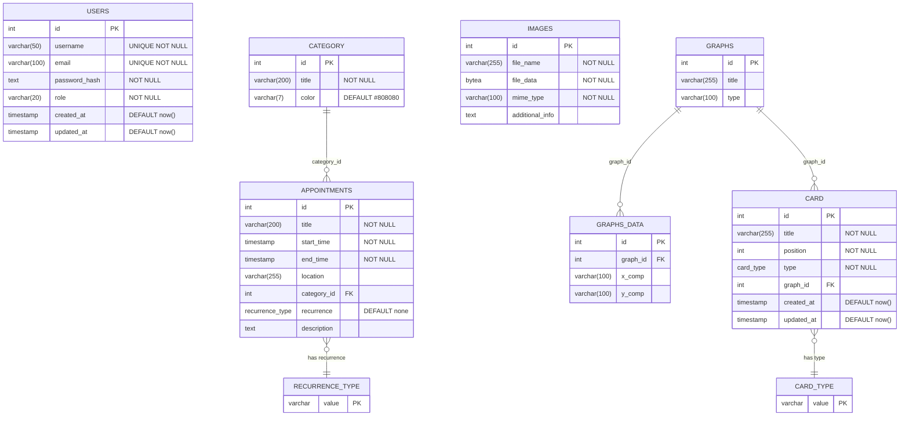
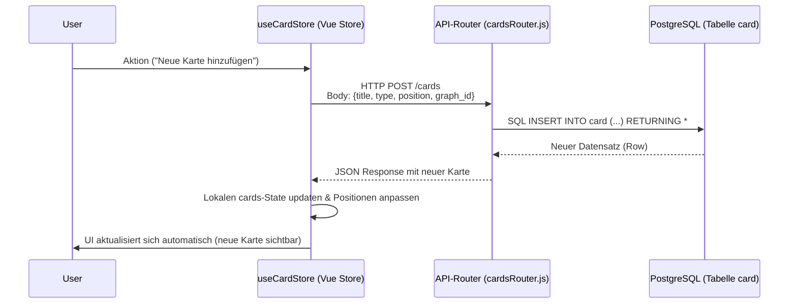
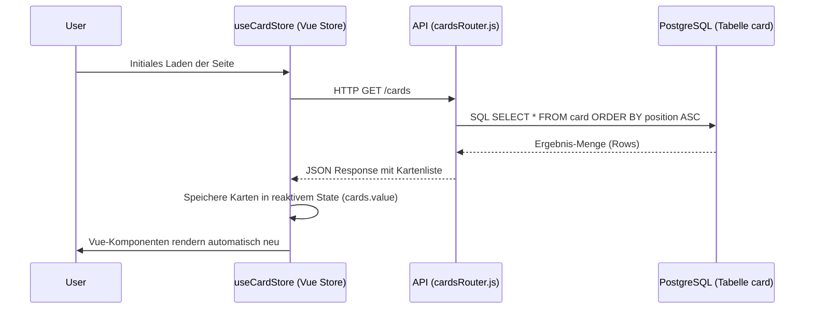

# Backend API Schnittstelle

Hier werden alle APIs für die Kommunikation zum Web-Server, 
sowie zur Datenbank als auch nach außen Implementiert.

Es gibt noch ne .env die nicht in git hochgeladen werden sollte.
Eine Vorlage dieser mit allen Variablen ist in .env.example.

## config.json
In der config.json werden Variablen für den Server während des Betriebs gelesen, geschrieben und persistent gespeichert, wie zum Beispiel die Postleitzahl.
Die config.json sollte initial vor der Konfiguration des Server so aussehen, damit die Werte gesetzt werden können: 
```
    {
        "plz":-1,
        "cityName":"",
        "regionalKey":-1
        "latitude": -1,
        "longitude": -1
    } 
```    

## Inbetriebnahme 

Um das Backend lokal zu starten, wird am besten **Docker Desktop** benötigt. Die gesamte Umgebung, inklusive der Datenbank, wird über Docker Compose gesteuert.

1.  **Repository klonen:**
    ```bash
    git clone https://github.com/TheSynus/SWP-SS25-SmartCities
    cd SmartCities_Backend
    ```

2.  **Umgebungsvariablen einrichten:**
    Kopiere die Vorlagedatei `api/.env.example` und benenne sie in `api/.env` um. Trage dort die notwendigen Werte ein wie den `WEATHER_API_KEY`.

3.  **Stack bauen & starten:**  
    Starte Starte mit folgendem Befehl den Docker-Stack:
    ```bash
    docker compose up --build -d
    ```
    Es starten alle notwendigen Container (API, Datenbank, pgAdmin). Beim ersten Start wird das Datenbankschema aus `db/init.sql` automatisch angelegt.

4.  **Server Konfigurieren:**
    Nach dem ersten Start müssen die Server-Einstellungen über die `/setup`-Routen (siehe unten) konfiguriert werden, damit die externen APIs funktionieren.

Der API-Server ist nun unter `http://localhost:3000` erreichbar.

## APIs

### /setup/...
Routen zum initialen Setzen von für den Serverbetrieb benötigten Variablenwerten
* **/setup/plz:** POST-Request zum initialen Setzen der Postleitzahl auf die Postleitzahl der Gemeinde.\
Aufbau des JSON-Request-Bodies: `{ "plz" : "12345" }`, plz-Wert muss aus 5 Ziffern bestehen
* **/setup/regionalkey:** POST-Request zum initialen Setzen des Regionalschlüssels auf den Regionalschlüssel der Gemeinde.\
Aufbau des JSON-Request-Bodies: `{ "regionalKey": "010560050050" }`, regionalKey-Wert muss aus 12 Ziffern bestehen
* **/setup/geo-coords:** POST-Request zum initialen Setzen von Geokoordinaten der Gemeinde.\
Aufbau des JSON-Request-Bodies: `{ "lat": 53.58, "lon": 9.70 }`, Abtrennung der Koordinaten mit einem Punkt.\
Erhalt der Geokoortinaten z.B. einfach durch Google-Maps möglich.

### /nina/...
Routen zum Abfragen von NINA-Warndaten für den Kreis der Gemeinde über den Regionalschlüssel
* **/nina/call:** GET-Request zum Abfragen aktueller Warndaten.\
Aufbau des JSON-Response-Bodies: 
``` 
[
    {
        "url": "warnung.bund.de Link der Warnmeldung mit MeldungsID",
        "type": "Typ der Warndmeldung",
        "headline": "Titel der Warnmeldung",
        "severity": "Schwere der Warnmeldung"
    },
    ...
]
```
* **/nina/test:** GET-Request zum Abfragen von statisch gesetzten Testdaten im gleichen Format wie **/nina/call**.\
Aufbau des JSON-Response-Bodies:
```
[
  {
    "url": "https://warnung.bund.de/meldungen/mow.DE-NW-BN-SE030-20201014-30-000",
    "type": "ALERT",
    "headline": "Coronavirus; Informationen des Bundesministeriums für  Gesundheit",
    "severity": "Minor"
  },
  {
    "url": "https://warnung.bund.de/meldungen/mow.DE-NW-BN-SE030-20201014-30-000",
    "type": "ALERT",
    "headline": "Coronavirus; Informationen des Bundesministeriums für  Gesundheit",
    "severity": "Minor"
  }
]
```

### /weather/...
Routen zum Abfragen des aktuellen Wetters
* **/weather/call** GET-Request zum Abfragen des aktuellen Wetters und der stündlichen Prognose für die nächsten 24 Stunden.\
Aufgrund des API-Keys (Gratisversion) nur Vorhersagen für jeweils 3 Stunden Intervalle, daher Timestamps in 3 Stunden Rahmen.\
Aufbau des JSON-Response-Bodies:
```
  [
    {
      "temp": Temperatur in Grad Celsius,
      "temp_feels_like": Gefühlte Temperatur in Grad Celsius,
      "wind_speed": Windgeschwindigkeit in m/s,
      "wind_deg": Windrichtung in Grad,
      "sky": aktuelle Wetterlage (Clouds, Rain, Snow, ...),
      "weather_icon": Code für das OpenWeather-Icon zum Wetter: https://openweathermap.org/weather-conditions#How-to-get-icon-URL,
      "timestamp": Zeitpunkt für die Wettervorhersage - 1. = aktuelle Uhrzeit, 2-4 = nächste 3 Stunden
    },
    {
      "temp": 18.74000000000001,
      "temp_feels_like": 18.390000000000043,
      "wind_speed": 1.9,
      "wind_deg": 336,
      "sky": "Clear",
      "weather_icon": "01n",
      "timestamp": "2025-06-20 21:00:00"
    },
    ...
  ]
```

### Datenbank-Routen
Routen zur Interaktion mit der zugrundeliegenden Datenbank, stellen grundlegende CRUD-Operationen zur Verfügung. Sie unterstützen die Standard-HTTP-Methoden (GET, POST, PUT, DELETE).

* **/appointments** Verwaltung von Terminen.
* **/cards** Verwaltung der Dashboard-Karten, inklusive Positionierung.
* **/categorys** Verwaltung von Kategorien, die z.B. für Termine verwendet werden.
* **/graphs** Verwaltung von Graphen. Bietet einen speziellen POST /graphs/uploadJson Endpunkt, um einen Graphen inklusive aller seiner Datenpunkte in einer einzigen Anfrage zu erstellen.
* **/marker** Verwaltung von Events.

**Router aufbau**

Da alle Router gleich aufgebaut sind hier einmal beispielhaft hier einmal die Struktur anhand des Marker-Routers

  | Methode | Endpunkt | Beschreibung |
  | ------- | -------- | ------------ |
  | POST | /marker/ | Erstellt neuen Marker |
  | GET | /marker/ | Liefert alle Marker zurück
  | GET | /marker/:id | Liefert Marker basierend auf einer ID zurück
  | PATCH | /marker/:id | Zum bearbeiten von bestehenden Markern
  | DELETE | /marker/:id | Löscht einen Marker basierend auf der ID

**Beispiel für das Testen mit cURL:**

```bash
# Hochladen eines Graphen mit gültigen Daten
curl -X POST "http://localhost:3000/graphs/uploadJson" -H "Content-Type: application/json" -d "@testData/body.json"

# Hochladen eines Graphen mit ungültigen Daten
curl -X POST "http://localhost:3000/graphs/uploadJson" -H "Content-Type: application/json" -d "@testData/badbody.json"
```


# Architektur & Datenmodell 
Die Anwendung ist in drei Docker-Container aufgeteilt: die API (Node.js), die PostgreSQL-Datenbank und eine pgAdmin-Instanz zur Verwaltung. Das Herzstück des Backends ist das relationale Datenmodell in der PostgreSQL-Datenbank, welches die Grundlage für alle CRUD-Operationen bildet.


### **Datenbankschema:**
Das Schema definiert alle Entitäten wie appointments, cards oder graphs und deren Beziehungen untereinander. Es wird beim ersten Start der Docker-Container automatisch aus der db/init.sql-Datei erstellt.




### Datenfluss
Die folgenden Diagramme stellen den typischen Datenfluss vom Frontend über die API zur Datenbank am Beispiel der Dashboard-Karten (cards) dar.


#### **Sequenzdiagramm - Schreiben in die Datenbank:**




#### **Sequenzdiagramm - Lesen aus der Datenbank:**

